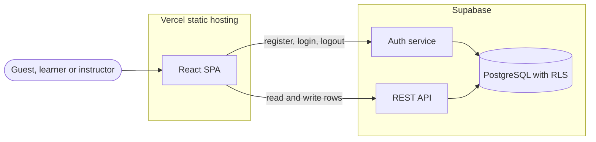
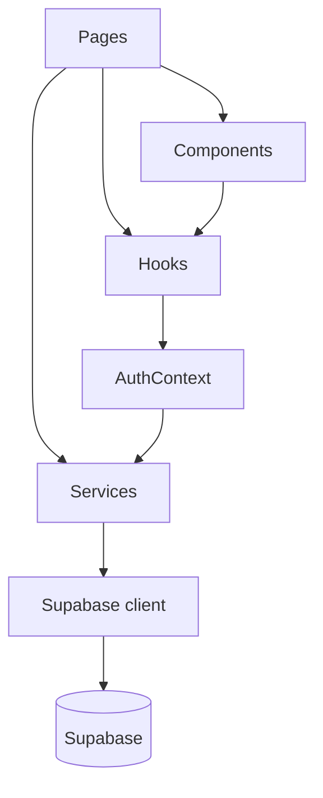
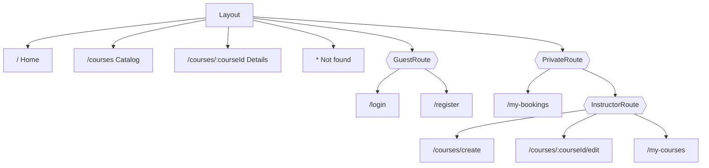
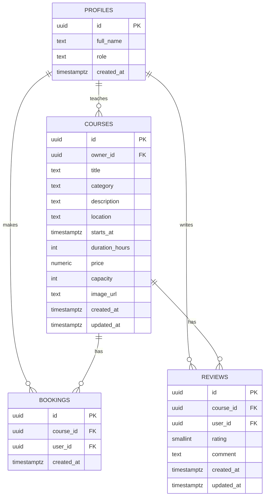
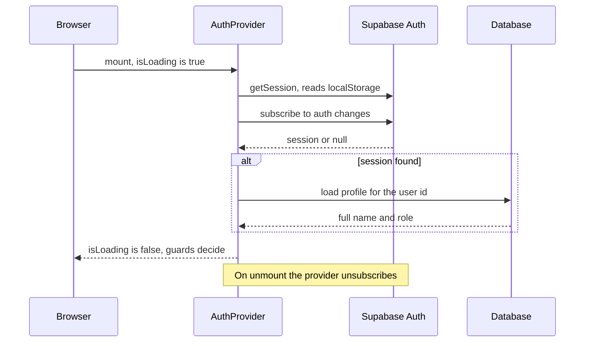
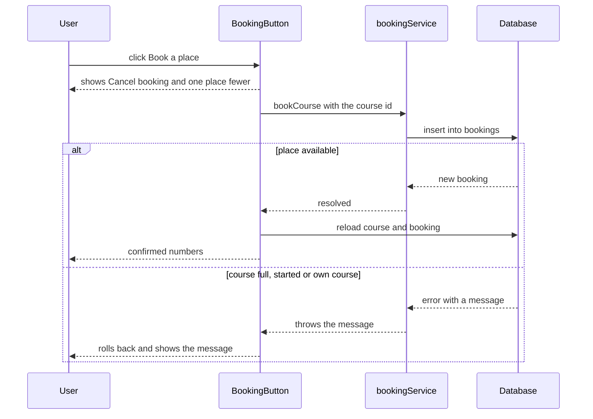

# RescueReady – Architecture

RescueReady is a single page application for booking safety and first aid training courses. Instructors publish courses; learners and other instructors book places and leave reviews. This document describes how the application is put together.

## 1. Stack

| Part | Technology | Role |
|---|---|---|
| UI | React 19 (JavaScript, `.jsx`) | Components, hooks, Context |
| Build tool | Vite 8 | Development server and production build |
| Routing | React Router 8 (`react-router`) | Client-side routes, guards, URL parameters |
| Backend | Supabase | Hosted PostgreSQL, authentication, REST API |
| Backend client | `@supabase/supabase-js` 2 | All network communication |
| Styling | CSS Modules + design tokens | One `.module.css` per component, shared CSS variables |
| Tests | Vitest + React Testing Library | Unit tests for validators, hooks and guards |
| Hosting | Vercel (frontend), Supabase (backend) | Both publicly reachable |

## 2. System overview

There is no custom server. The React application talks to Supabase directly from the browser. Access control is enforced by the database through Row Level Security (RLS), so a request that the user interface would never send is still refused.



## 3. Folder structure

```
.
├── index.html
├── vite.config.js
├── supabase/
│   └── schema.sql              tables, view, triggers, RLS policies
└── src/
    ├── main.jsx                entry point: router and auth provider
    ├── App.jsx                 route table
    ├── lib/
    │   └── supabaseClient.js   the single Supabase client
    ├── services/               every API call, one file per collection
    │   ├── authService.js
    │   ├── courseService.js
    │   ├── bookingService.js
    │   └── reviewService.js
    ├── contexts/
    │   ├── AuthContext.js      the context object
    │   └── AuthProvider.jsx    session, profile and auth actions
    ├── hooks/
    │   ├── useAuth.js          reads AuthContext
    │   ├── useForm.js          controlled form state and validation
    │   └── useDebounce.js      delays a value (catalog search)
    ├── guards/
    │   ├── PrivateRoute.jsx    logged-in users only
    │   ├── GuestRoute.jsx      guests only
    │   └── InstructorRoute.jsx instructors only
    ├── components/
    │   ├── layout/             Layout, Header, Footer
    │   ├── ui/                 Button, Field, Spinner, ErrorMessage, EmptyState, ConfirmDialog
    │   ├── courses/            CourseCard, CourseForm, CourseFilters, BookingButton
    │   └── reviews/            ReviewList, ReviewForm
    ├── pages/                  one component per route
    ├── utils/                  validators, formatters, error messages, constants
    ├── styles/                 tokens.css, global.css
    └── test/                   test setup
```

Each component lives next to its own `Component.module.css`.

## 4. Layers

Code depends in one direction only. A page may use components, hooks and services. A component never calls Supabase directly; it goes through a service.



| Layer | Responsibility | Knows about |
|---|---|---|
| Pages | Load data for a route, hold page state, compose components | Components, hooks, services |
| Components | Render props, raise events | Hooks, other components |
| Hooks | Reusable stateful logic | Context |
| Context | Who is logged in | Auth service |
| Services | One function per API operation; turn errors into readable messages | Supabase client |
| Supabase client | Connection settings | Environment variables |

Services return data or throw an `Error` with a message that can be shown to the user. Pages decide how to display loading, error and empty states.

## 5. Routing

All routes are children of one layout route that renders the header, the footer and an `<Outlet />`. Guards are layout routes too: they render an `<Outlet />` when access is allowed and a redirect when it is not.



| Route | Page | Guest | Learner | Instructor |
|---|---|---|---|---|
| `/` | Home | Yes | Yes | Yes |
| `/courses` | Catalog | Yes | Yes | Yes |
| `/courses/:courseId` | Course details | Yes | Yes | Yes |
| `/login`, `/register` | Login, Register | Yes | Redirected to catalog | Redirected to catalog |
| `/my-bookings` | My bookings | Redirected to login | Yes | Yes |
| `/courses/create` | Create course | Redirected to login | Redirected to catalog | Yes |
| `/courses/:courseId/edit` | Edit course | Redirected to login | Redirected to catalog | Author only |
| `/my-courses` | My courses | Redirected to login | Redirected to catalog | Yes |
| `*` | Not found | Yes | Yes | Yes |

Guard behaviour:

- While the session is being restored, guards render a loader and do not redirect.
- `PrivateRoute` remembers the page the guest wanted. `GuestRoute` sends the user back to it after login or registration.
- The Edit page adds an ownership check: an instructor who is not the author is redirected to the details page.
- The Create and Edit pages are loaded lazily with `React.lazy` and `Suspense`, because guests and learners never need them.

## 6. Pages and components

| Page | Built from | Data it loads |
|---|---|---|
| Home | CourseCard | Next upcoming courses |
| Catalog | CourseFilters, CourseCard, Spinner, ErrorMessage, EmptyState | Courses, filtered and sorted by the API |
| Course details | BookingButton, ReviewList, ReviewForm, ConfirmDialog | One course, its reviews, the user's booking |
| Create course | CourseForm | – |
| Edit course | CourseForm | One course |
| My courses | CourseCard, EmptyState | Courses the instructor teaches |
| My bookings | EmptyState | The user's bookings with their courses |
| Login, Register | Field, Button | – |
| Not found | – | – |

`CourseForm` is shared by Create and Edit. `Button` and `Field` are the only button and form-field components, so every form looks and behaves the same.

## 7. State

| State | Where it lives | Why |
|---|---|---|
| Current user, profile (name, role), `isLoading` | `AuthContext` | Needed by the header, the guards and most pages |
| Session tokens | `localStorage`, managed by the Supabase client | Survives a page refresh |
| Lists and records (courses, reviews, bookings) | Local state of the page that shows them | Not shared between pages; reloaded when the page opens |
| Form values, errors, submitting flag | `useForm` inside each form | Local to the form |
| Catalog search, category, sort | Local state of the Catalog page | Drives the request |
| Booking button result before the server answers | `useOptimistic` in `BookingButton` | Instant feedback, rolled back if the request fails |

There is no global data store. The only shared state is authentication.

### Component lifecycle in use

- **Mount:** `AuthProvider` restores the session and subscribes to auth changes. Each page loads its data.
- **Update:** the Catalog effect depends on the search text, category and sort order, and runs again when any of them changes. `AuthProvider` loads the profile again when the user changes.
- **Unmount:** `AuthProvider` unsubscribes from auth changes. Data-loading effects mark their request as stale, so a late response is ignored. The search debounce clears its timer.

## 8. Data model



- `profiles.id` is the same value as the user's id in Supabase Auth. A database trigger creates the profile when a user registers.
- `profiles.role` is `learner` or `instructor`. It is set at registration and cannot be changed by the user.
- A user can have one booking and one review per course.
- The `course_catalog` view returns each course with the instructor's name, the number of places booked, the places left, the number of reviews and the average rating. Catalog, details, home and "my courses" read from this view.

### Who can do what (Row Level Security)

| Table | Read | Create | Update | Delete |
|---|---|---|---|---|
| `profiles` | Everyone | Trigger only | Own name only | – |
| `courses` | Everyone | Instructors | Author | Author |
| `bookings` | Own bookings | Logged-in users, for themselves | – | Own bookings |
| `reviews` | Everyone | Logged-in users, not on their own course | Author | Author |

### Rules enforced by the database

| Rule | Message returned |
|---|---|
| A course must start in the future | The course start date must be in the future. |
| Capacity cannot go below the places already booked | Capacity cannot be lower than the number of places already booked. |
| An instructor cannot book their own course | You cannot book a place on your own course. |
| A course that has started cannot be booked | This course has already started. |
| A full course cannot be booked | This course is fully booked. |

Field lengths, ranges and allowed categories are repeated as `CHECK` constraints, so the client-side validation is a convenience and not the only protection.

## 9. Key flows

### Application load and session restore



### Booking a place



## 10. Error handling

- **Services** convert every Supabase error into an `Error` with a readable message. Messages raised by the database (section 8) pass through unchanged. Network failures and duplicate records get their own wording.
- **Pages that load data** have four states: loading, error with a "Try again" button, empty, and content.
- **Forms** validate on blur and on submit, show field errors under the field, show server errors above the form, and keep what the user typed.
- **Missing records:** an unknown course id shows "Course not found" with a link to the catalog. An unknown URL shows the Not found page.
- **Reads are retried** by the Supabase client on network failure (about seven seconds in total) before an error is reported. Writes are not retried.

## 11. Styling

- `styles/tokens.css` defines every colour, font size, space, radius and shadow as a CSS variable. Components use the variables, never raw values.
- `styles/global.css` holds the reset and base element styles.
- Each component has a CSS Module, so class names cannot collide.
- Layout is mobile-first and checked at 375, 768 and 1280 pixels wide.

## 12. Requirements map

| Requirement | Where it is implemented |
|---|---|
| 3+ dynamic pages | Home, Catalog, Course details, Create, Edit, My courses, My bookings |
| 5+ routes, 2+ with URL parameters | `App.jsx`; `/courses/:courseId` and `/courses/:courseId/edit` |
| Catalog and Details views | `pages/Catalog`, `pages/CourseDetails` |
| Route guards | `guards/PrivateRoute`, `GuestRoute`, `InstructorRoute` |
| Register, Login, Logout | `pages/Register`, `pages/Login`, `Header`, `services/authService` |
| Session recognised across the app | `contexts/AuthProvider`, `hooks/useAuth` |
| Remote data, no hardcoded data | `services/*` through `lib/supabaseClient` |
| Full CRUD on a collection | `courses`: `services/courseService`, `components/courses/CourseForm` |
| Only the author can edit or delete | UI checks in `CourseDetails` and `CourseEdit`; RLS policies in `supabase/schema.sql` |
| Controlled forms and synthetic events | `hooks/useForm`, all forms |
| Validation and error handling | `utils/validators`, `utils/errors`, page states |
| User interaction with records | Bookings and reviews |
| Hooks and lifecycle | `useState`, `useEffect`, `useContext`, `useOptimistic`, custom hooks; section 7 |
| Context API | `AuthContext` |
| Component structure and external CSS | `components/`, `pages/`, CSS Modules |
| Architecture documentation | This file |
